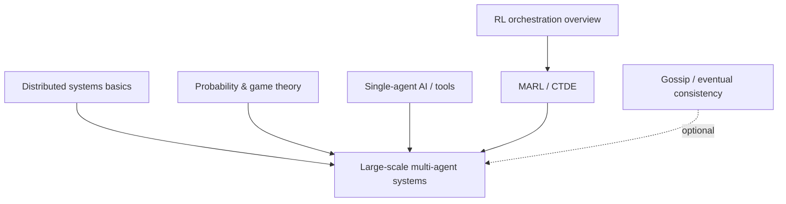
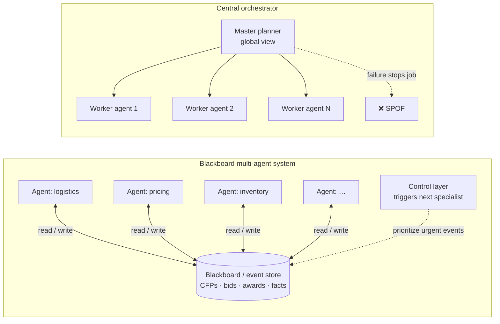
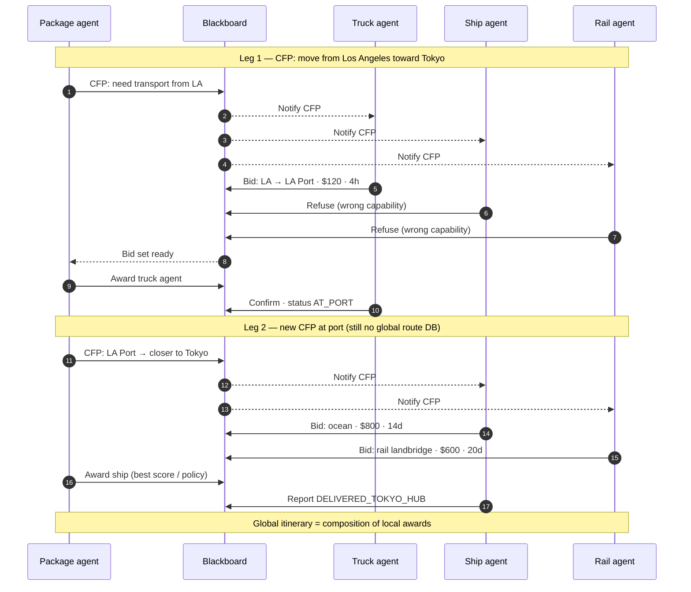
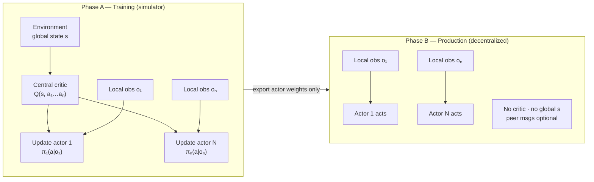
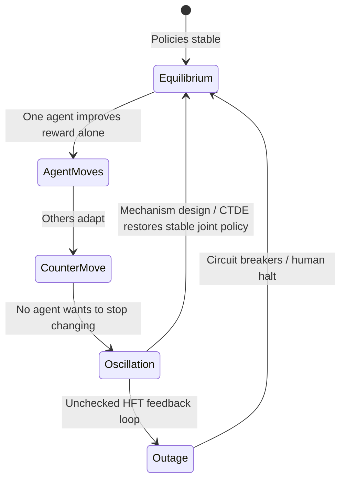

## Prerequisites

## When to use

- **Decentralized coordination** where no single planner can see global state (supply chains, markets, sensor swarms).
- **Emergent optimization** via local bids, auctions, or blackboard posts instead of one brittle orchestrator.
- **Fault tolerance** when losing a fraction of agents must not halt the whole system (probabilistic self-healing).

## When not to use

- You need a **single source of truth** and strict global ordering (prefer Raft, Spanner, or a central workflow engine).
- **Low agent count** with simple DAG tasks — a job queue and one scheduler is cheaper to build and debug.
- **Adversarial agents** without mechanism design — naive bidding can game prices or oscillate (no Nash guarantee).

## How to read the diagrams

The three Mermaid figures below are the main teaching path for this topic (no interactive lab yet). Start with **architecture** (central vs blackboard), follow the **contract-net sequence** for how a global route emerges without a route database, then study **CTDE** for how modern MARL trains cooperation but deploys decentrally.

---

## Simple Fundamental Explanation
Imagine a single ant trying to build a giant anthill. It is weak, lacks a blueprint, and eventually dies of exhaustion. The anthill never gets built.
Now imagine 100,000 ants. There is no "CEO Ant" giving orders. Every ant follows a few very simple rules (e.g., "If I smell a pheromone trail, follow it. If I find a stick, drop it near other sticks"). Through these simple, local, probabilistic interactions, a massive, highly complex, and perfectly ventilated anthill emerges.

In AI, a **Large-Scale Multi-Agent System (MAS)** operates exactly like this. Instead of building one giant, omniscient God-AI to run a factory or a stock market, engineers deploy thousands of tiny, specialized AI Agents. They don't have global knowledge. They just talk to their immediate neighbors, negotiate, and trade. Out of this chaos, a perfectly optimized, highly resilient global system emerges.

---

## Deep Dive: How It Works Under the Hood

Scaling from one Agent (see `NEXT_GEN_AI_AGENTS.md`) to 10,000 Agents requires entirely different infrastructure.

### The Blackboard Pattern
Agents need a way to communicate without talking directly to 9,999 other agents (which would cause an $O(N^2)$ network collapse).
They use a shared memory space called a **Blackboard** (or today: an event store / message board with a schema).

- Agent A posts: "I need 5 tons of steel in New York. I will pay $500."
- Agents B, C, and D read the blackboard.
- Agent C replies: "I have 5 tons of steel in Boston. I will deliver for $450."

Specialists do not need each other's addresses — only read/write access to shared state. A thin **control** layer (scheduler or rule engine) can decide which agent acts next, but there is no omniscient route planner.

### Diagram 1 — Architecture: orchestrator vs blackboard MAS

Compare a **central master** (single point of failure, must know everything) with a **blackboard** (agents couple through shared state; coordination cost scales with *posts*, not $N^2$ pairwise chats).

**Reading the diagram:** Arrows into the blackboard are *partial solutions* (bids, sensor readings, hypotheses). New agents can subscribe without rewiring the whole graph — the pattern used in classical Hearsay-II speech understanding and modern event-driven ops stacks.

### Emergent Behavior and Fault Tolerance
If a central orchestrator crashes, the system stops.
In an MAS, if 500 agents randomly crash, the system doesn't stop. The remaining 9,500 agents look at the Blackboard, notice that steel isn't being delivered, adjust their prices (raising the reward), and other agents naturally pivot to fill the gap. The system mathematically heals itself through economics and probability.

### Diagram 2 — Contract Net Protocol: emergent LA → Tokyo route

The [**Contract Net Protocol**](https://en.wikipedia.org/wiki/Contract_Net_Protocol) (Smith, 1980) is the standard pattern for task allocation: a **manager** posts a *call for proposals* (CFP), **contractors** bid with local knowledge only, the manager **awards** one winner per leg. No agent holds the full multimodal route — the journey is a chain of local contracts on the blackboard.

**Why this matters:** Production systems often hybridize — centralized **policy** (quotas, safety caps) with **decentralized bidding** inside those guardrails. If 500 agents crash, remaining agents see unfilled CFPs, raise rewards, and refill capacity without restarting a central planner.

---

## Practical Example: Automated High-Frequency Trading

The modern stock market is the ultimate Large-Scale Multi-Agent System.

There is no central AI setting the price of Apple stock.
Instead, thousands of hedge funds deploy millions of algorithmic trading agents.
- **Market Maker Agents**: Constantly provide liquidity, trying to profit off the spread.
- **Arbitrage Agents**: Look for millisecond price discrepancies between New York and London.
- **Sentiment Agents**: Read Twitter streams and dump stock if bad news hits.

These agents interact fiercely in a purely decentralized environment. No single agent knows what the other agents are doing. Yet, through their aggressive, probabilistic local interactions (buying and selling), the system instantly converges on a globally optimal, hyper-efficient market price for the asset.

---

## The Mathematics: Equations and In-Depth Analysis

### 1. Game Theory and Nash Equilibrium
In a multi-agent system, the environment is non-stationary. The "best" action for Agent A depends entirely on what Agent B is currently doing.

The system is modeled as a Stochastic Game.
The mathematical goal is for the swarm to reach a **Nash Equilibrium**. A Nash Equilibrium is a state where no single agent can increase its own reward by unilaterally changing its strategy, assuming all other agents keep their strategies the same.

If an MAS does not have a mathematically guaranteed Nash Equilibrium, the agents might enter a destructive oscillation loop (e.g., Agent A buys, causing Agent B to sell, causing Agent A to sell, causing a market flash crash).

### 2. Multi-Agent Reinforcement Learning (MARL)
Training 10,000 agents simultaneously is extremely difficult.
The most common approach is **Centralized Training with Decentralized Execution (CTDE)** — used in MADDPG, MAPPO, QMIX, and related algorithms.

During training (in a massive simulator), a central **Critic** (see `REINFORCEMENT_LEARNING_ORCHESTRATION.md`) sees the **global state** $s$ and joint actions $(a_1,\dots,a_N)$. Each **Actor** $\pi_i$ only receives **local observations** $o_i$ but is updated using the critic's $Q(s,a_1,\dots,a_N)$ so credit assignment respects other agents' moves.

$$
\nabla J(\theta) = \mathbb{E} \left[ \nabla_\theta \log \pi_\theta(a_i \mid o_i) \cdot Q_{\text{central}}(s, a_1, \dots, a_N) \right]
$$

At **deployment**, the critic is discarded. Actors run on local sensors only — no shared blackboard required for inference — yet policies remain coordinated because training encoded team-level value.

### Diagram 3 — CTDE: train with global critic, deploy with local actors only

### Diagram 4 — When Nash equilibrium breaks: strategy oscillation

If agents are competitive and no stable **Nash equilibrium** exists, unilateral strategy changes can loop — the flash-crash pattern in automated markets.

**Reading the diagram:** MARL + CTDE targets a cooperative equilibrium during training; market-style MAS may still need exogenous guardrails (limits, fees, kill switches) when agents are adversarial.
