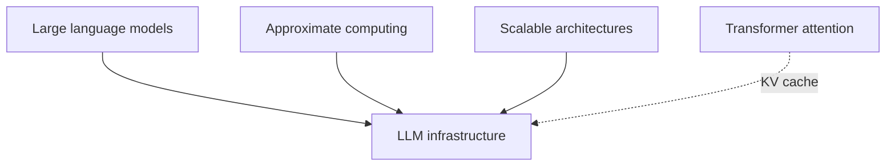
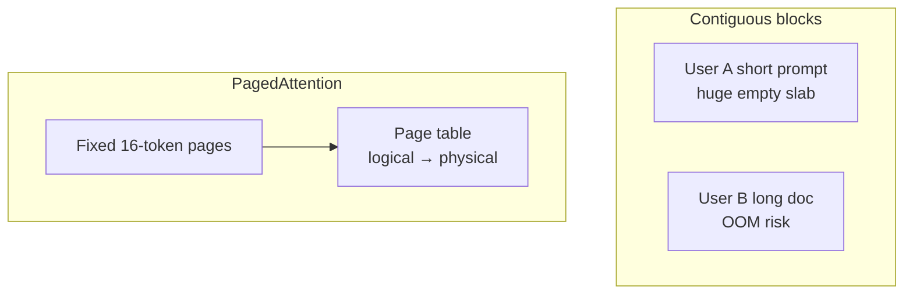
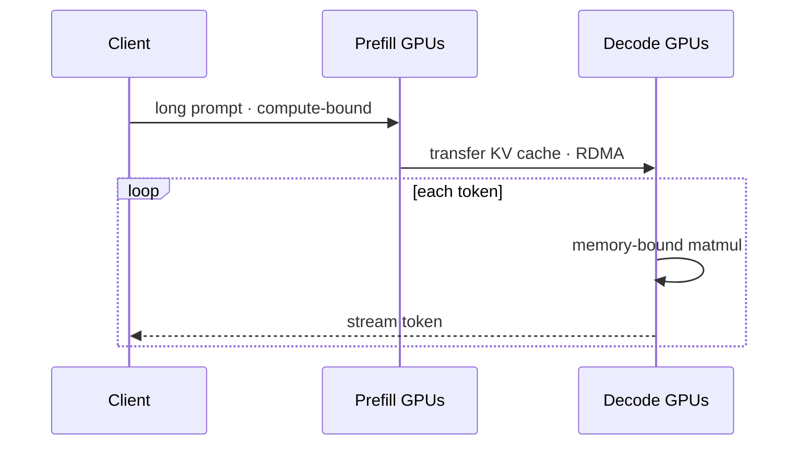

## Prerequisites



## When to use

- **Production inference** for chat, agents, or APIs where GPU memory and batching dominate cost.
- **Many concurrent sessions** needing KV cache management (PagedAttention) and continuous batching.
- **Split prefill/decode** clusters when prompt encoding and token generation have different bottlenecks.

## When not to use

- **Offline batch scoring** with no latency SLO — simpler batch jobs may suffice.
- **Models that fit in CPU RAM** at low QPS — full GPU stacks may be overkill.
- **Training from scratch** — use large-scale ML infrastructure instead.

## How to read the diagrams

**PagedAttention** shows non-contiguous KV pages versus wasted contiguous blocks; **prefill vs decode routing** shows why two GPU fleets optimize different arithmetic intensity regimes. The ascii VRAM layout below matches PagedAttention.

---

## Simple Fundamental Explanation
Imagine a normal web server (like a WordPress blog). When a user clicks "Load Page", the server reads a few kilobytes of text from a database and sends it back. It takes 50 milliseconds. A cheap $10/month server can handle thousands of users.

Now imagine a Large Language Model (like GPT-4). When a user asks a question, the server doesn't look up a database. It mathematically multiplies a 1,000-Gigabyte matrix of numbers, one word at a time, to generate an answer. It requires hundreds of thousands of dollars of specialized silicon (GPUs) just to answer *one* complex question quickly.

**LLM Infrastructure** is the hyper-specialized cloud architecture designed to load, serve, and scale massive neural networks. It focuses entirely on maximizing GPU utilization, minimizing memory bottlenecks, and probabilistically routing "tokens" (words) to keep latency low.

---

## Deep Dive: How It Works Under the Hood

Serving LLMs (Inference) is completely different from Training. Training requires moving massive gradients. Inference requires generating tokens one by one as fast as possible.

### 1. KV Caching
When an LLM generates the 100th word of an essay, it has to re-calculate the attention scores (see `TRANSFORMER_ATTENTION.md`) for the first 99 words. Doing this from scratch every time is a massive waste of compute.
Instead, infrastructure caches the Keys and Values (KV Cache) of the previous tokens in the GPU's ultra-fast HBM (High Bandwidth Memory).
The major bottleneck in LLM infrastructure is not usually compute (TFLOPs), it is running out of VRAM to store the KV Cache for thousands of simultaneous users.

### 2. PagedAttention (vLLM)
Historically, KV Cache was allocated in giant, contiguous blocks of memory. If a user asked a short question, 90% of the allocated memory block was wasted (fragmentation).
Researchers at Berkeley invented **PagedAttention**. Similar to how an Operating System manages virtual memory, PagedAttention splits the KV Cache into small, fixed-size pages. It probabilistically allocates and frees these pages dynamically. This eliminated memory fragmentation, allowing a single GPU cluster to serve 4x to 5x more simultaneous users.

### 3. Continuous Batching
A GPU is most efficient when processing huge batches of data simultaneously.
In traditional ML, if 4 users asked a question, the server waited until all 4 answers were completely finished before returning them.
**Continuous Batching** (or In-Flight Batching) dynamically inserts new user requests into the GPU's execution batch at the exact microsecond a different user's request finishes. The GPU batch is constantly rolling, operating at near 100% saturation.

### Visual Diagram: PagedAttention

### Diagram 1 — Paged KV cache vs contiguous waste



### Diagram 2 — Prefill cluster vs decode cluster



<!-- diagram -->
```diagram
[ User A: "Write a poem about a cat." ] (Generates 50 tokens)
[ User B: "Translate this 500-page book." ] (Generates 50,000 tokens)

Standard Allocation (Wasted RAM):
User A: [ Block 1: 50 used | 9,950 empty space (Wasted) ]
User B: [ Block 2: 10,000 used ] -> OOM Crash!

PagedAttention Allocation (No waste):
VRAM is split into 16-token pages.
User A uses 4 pages.
User B uses thousands of pages scattered non-contiguously across the GPU.
A lookup table (Page Table) mathematically maps the virtual tokens to physical pages.
No RAM is wasted. GPU handles both users flawlessly.
```

---

## Practical Example: OpenAI's API Architecture

When millions of users hit the ChatGPT API, they don't all hit the same type of machine.

OpenAI uses advanced LLM infrastructure to route requests.
- **Prefill Phase**: When you paste a 100-page PDF into the prompt, the system must read and encode it. This is highly compute-bound. The infrastructure routes this to a specific cluster of GPUs highly optimized for massive matrix multiplication.
- **Decode Phase**: Once the PDF is read, the model starts generating the answer one word at a time. This is highly memory-bound. The system transfers the KV Cache over a high-speed network to a completely different cluster of GPUs optimized for high memory bandwidth (Decoding).

By separating the infrastructure into specialized Prefill and Decode clusters, they drastically improve the probabilistic utilization of the massive supercomputers.

---

## The Mathematics: Equations and In-Depth Analysis

### The Memory Wall (Arithmetic Intensity)
The fundamental mathematical limit of LLM infrastructure is Arithmetic Intensity ($I$), which is the ratio of mathematical operations (FLOPs) to memory bytes accessed:

$$
I = \frac{\text{Compute Operations}}{\text{Memory Bytes Transferred}}
$$

During the **Prefill** phase (reading the prompt), $I$ is extremely high. The GPU loads the weights once, and multiplies them against thousands of tokens simultaneously. The GPU achieves near 100% of its theoretical TFLOPs limit.

During the **Decode** phase (generating the answer one token at a time), $I$ is extremely low. To generate a single word, the GPU must load the *entire* 100GB model from VRAM into the compute cores, do a tiny amount of math, and write the answer back.
The time taken is bounded by the Memory Bandwidth ($BW$) of the GPU hardware.

$$
\text{Time per token} \approx \frac{\text{Model Size in Bytes}}{BW}
$$

If you run a 70 Billion parameter model (140 GB in 16-bit) on an Nvidia A100 (which has 2000 GB/s bandwidth), the theoretical absolute fastest it can generate a single token for a single user is:

$$
\frac{140 \text{ GB}}{2000 \text{ GB/s}} = 0.07 \text{ seconds (or 14 tokens per second)}
$$

This is the **Memory Wall**. No matter how much faster Nvidia makes the compute cores, the model cannot run faster than the VRAM can physically push data.
This equation is the sole reason why approximate computing techniques (like 4-bit Quantization, which shrinks the Model Size to 35GB and boosts the speed to 57 tokens/sec) are the most critical aspect of modern LLM infrastructure deployment.
