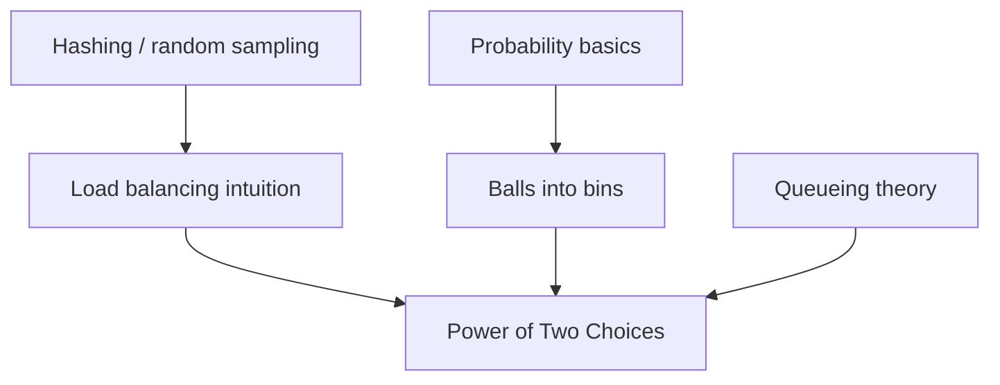

## Prerequisites



## When to use

- **Stateless load balancers** (NGINX `random two`, HAProxy) that must spread millions of requests without polling every backend.
- **Distributed hash tables and caches** where probing two buckets cuts tail latency vs single random placement.
- **Job schedulers** assigning tasks to workers when a full cluster scan is too expensive but hotspots are costly.

## When not to use

- You already maintain **accurate global load** cheaply (small clusters, centralized metrics) — shortest-queue may be worth the RPC cost.
- Workloads need **affinity or stickiness** (session routing) — random two breaks session locality unless layered with consistent hashing.
- **Three or more probes** rarely pay off: theory gains are linear in $1/\ln d$ after the jump from 1→2 choices.

## Lab

On the [interactive power-of-two lab](/topics/power-of-two-choices#lab), set **bins (N)**, **balls**, and **repeat trials**, then read the **bin load histogram** for Random vs Power-of-two assignment. Try **Many balls, few bins**, **Balanced cluster**, or **Large cluster** presets, predict which strategy has the **lower average max load** over trials, then reveal **random vs power-of-two** compared to the README’s $\ln N / \ln\ln N$ vs $\ln\ln N$ estimates.

## Simple Fundamental Explanation
Imagine you manage 100 checkout lanes at a massive supermarket. Customers are constantly arriving. How do you assign them to lanes so that no lane gets too backed up?

1.  **Round Robin**: You assign customer 1 to lane 1, customer 2 to lane 2... This requires you (a central manager) to perfectly track whose turn it is. This doesn't scale well.
2.  **Pure Random**: You just tell customers to pick a lane completely at random. This requires no central manager! But due to the clumping nature of randomness, some lanes will randomly get 0 people, and one unlucky lane will randomly get 5 people.
3.  **The Shortest Queue**: You look at all 100 lanes, count the people in every single one, and send the customer to the absolute shortest. This gives perfect balance, but scanning 100 lanes for every single customer takes way too long.

**The Power of Two Choices**: You tell the customer to pick exactly *two* lanes at random, look at both of them, and join the shorter one.

Surprisingly, this tiny amount of effort (checking 2 instead of 100) provides almost the exact same perfect balance as checking all 100 lanes, but with vastly less work.

---

## Deep Dive: How It Works Under the Hood

In distributed systems, a load balancer sits in front of a cluster of $N$ identical web servers. When an HTTP request comes in, the load balancer must decide which server handles it.

Polling all $N$ servers for their current CPU load is expensive and slow. Random assignment causes "hotspots"—servers that accidentally receive a burst of traffic and crash while others sit idle.

By picking two servers at random and routing the request to the less-loaded one, the load balancer applies a probabilistic dampening effect. If a server accidentally gets a burst of traffic, its queue grows. The moment its queue is larger than average, it is highly likely to lose the "compare" phase of the Two Choices algorithm. New traffic naturally routes around it until it drains its queue.

### Visual Diagram

<!-- diagram -->
```diagram
Servers: [ S1 (Load: 1) ] [ S2 (Load: 4) ] [ S3 (Load: 0) ] [ S4 (Load: 2) ]

Request 1 arrives:
Load Balancer randomly picks S2 and S4.
Compares: Load(S2) = 4, Load(S4) = 2.
Sends to S4.
S4 load becomes 3.

Request 2 arrives:
Load Balancer randomly picks S2 and S3.
Compares: Load(S2) = 4, Load(S3) = 0.
Sends to S3.
S3 load becomes 1.

Notice how the overloaded server (S2) is completely avoided,
allowing it time to clear its backlog.
```

---

## Practical Example: NGINX and HAProxy

Modern high-performance software load balancers like NGINX and HAProxy implement the Power of Two Choices (often called "Random with Two Choices" or `random two` in configuration files).

When a CDN needs to balance traffic across 1,000 backend application servers, keeping a perfectly synchronized state of all 1,000 servers across multiple distributed load balancers is impossible.

By using the Two Choices algorithm, the load balancers don't need global state. They just need to make two quick RPC calls (or check a slightly-stale cached state) of two random servers. This allows the load balancers to process millions of requests per second with incredibly tight CPU constraints while keeping the backend cluster perfectly balanced.

---

## The Mathematics: Equations and In-Depth Analysis

The mathematical analysis of this algorithm was formalized by Michael Mitzenmacher in 1996 ("The Power of Two Choices in Randomized Load Balancing").

Assume we have $N$ servers and $N$ requests arriving sequentially.

### 1. Pure Random (1 Choice)
If we assign each request to a purely random server, this is equivalent to throwing $N$ balls into $N$ bins.
The maximum number of balls in any single bin (the maximum load on the most stressed server) is expected to be:

$$
\text{Max Load} \approx \frac{\ln N}{\ln \ln N}
$$

For $N = 1,000,000$, the max load is roughly 4.3.

### 2. The Power of Two Choices (2 Choices)
If we pick $d$ bins at random and place the ball in the least full bin, the expected maximum load drops exponentially. For $d=2$:

$$
\text{Max Load} \approx \frac{\ln \ln N}{\ln 2} + O(1)
$$

For $N = 1,000,000$, the max load is roughly 2.5. The difference grows massive as $N$ increases.

### Why does the math work?
The function $\ln \ln N$ grows incredibly slowly.
- $\ln \ln (10) \approx 0.83$
- $\ln \ln (1,000,000) \approx 2.6$
- $\ln \ln (10^{100}) \approx 5.4$

This means that no matter how massive your cluster gets, the maximum load on your most stressed server will barely increase.

### Why not 3 choices?
The formula for $d$ choices is $\frac{\ln \ln N}{\ln d}$.
Moving from 1 choice to 2 choices changes the numerator from $\ln N$ to $\ln \ln N$, which is an exponential improvement.
Moving from 2 choices to 3 choices only changes the denominator from $\ln 2$ (0.69) to $\ln 3$ (1.09). This is a tiny, linear improvement that usually does not justify the 50% increase in network overhead (checking 3 servers instead of 2). Therefore, 2 choices is the mathematical sweet spot.
