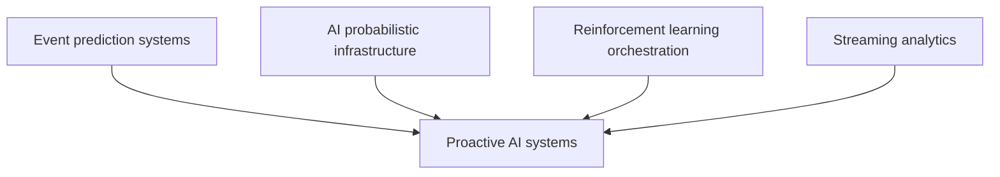
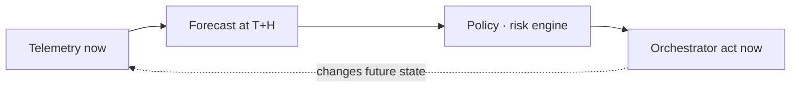
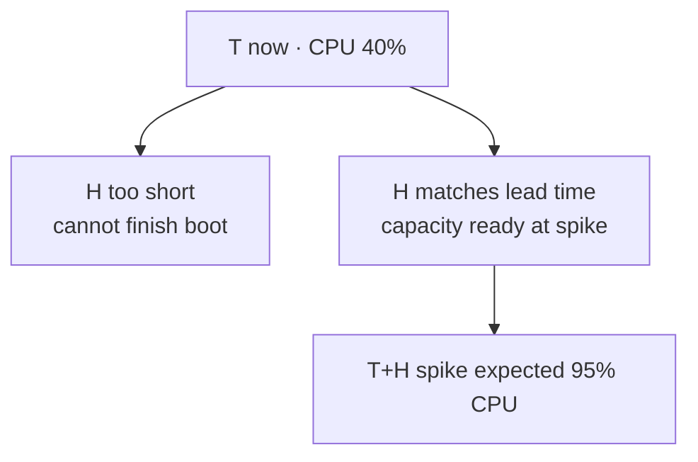

## Prerequisites



## When to use

- **Remediation lead time** longer than the prediction horizon (boot VMs, clone disks, warm caches).
- **Asymmetric failure costs** where acting early on a likely event beats waiting for certainty.
- **Continuous telemetry** feeding forecasts and policy engines at production cadence.

## When not to use

- **Horizon shorter than actuation** — predictions arrive after you could have reacted anyway.
- **Flat cost of false positives** — proactive over-provisioning wastes money without benefit.
- **No historical seasonality** — cold-start forecasts are too noisy to trust.

## How to read the diagrams

The **proactive control loop** moves decisions to T+horizon; the **horizon window** chart shows why H must exceed infrastructure lead time. The ascii loop below names the same blocks.

---

## Simple Fundamental Explanation
Imagine a chess computer.
- **Reactive AI**: The computer waits for you to make a move. Then it looks at the board, calculates its best response, and moves.
- **Proactive AI**: While you are staring at the board trying to decide your move, the computer is actively running thousands of probabilistic simulations of what you *might* do, and pre-calculating its responses. When you finally move, the computer instantly moves, because it already solved that branch of the future.

In software infrastructure, a **Proactive AI System** uses continuous probabilistic inference to predict future state changes and executes corrective or optimizing actions *before* the trigger event actually occurs. It shifts software from a reactive loop (`if X happens, then do Y`) to a predictive loop (`I am 95% confident X will happen in 5 minutes, doing Y now`).

---

## Deep Dive: How It Works Under the Hood

Proactive systems combine Streaming Analytics (for real-time context) with Time-Series Forecasting and Reinforcement Learning (for action generation).

### 1. The Horizon Window
A reactive system operates at $T_0$ (Now).
A proactive system operates at $T_{now} + H$, where $H$ is the Horizon.
If $H$ is too short, the system doesn't have time to act (e.g., booting a server takes 3 minutes, but the system only predicts 1 minute ahead).
If $H$ is too long, the probabilistic variance explodes, and the predictions become wild guesses.

### 2. Multi-Objective Optimization
Proactive AI must balance competing desires.
- Over-predicting traffic means provisioning too many servers (Wasting Money).
- Under-predicting traffic means dropping requests (Losing Customers).
The AI continuously adjusts its probability thresholds based on a mathematically weighted cost function.

### Visual Diagram: The Proactive Control Loop

### Diagram 1 — Forecast-driven control loop



### Diagram 2 — Horizon vs boot lead time



<!-- diagram -->
```diagram
[ Real-Time Telemetry ] ----> [ Probabilistic Forecast Engine ]
      (e.g., CPU=40%)                 (e.g., LSTM Model)
                                              |
                                              v
                               [ Predicted State at T+10m ]
                               (e.g., CPU expected = 95%)
                                              |
                                              v
                                  [ Policy / Risk Engine ]
                           (Is 95% > Threshold? Yes. Action required.)
                                              |
                                              v
[ Cluster Orchestrator ] <--------- [ Action Generator ]
   (Boots new VM now)             (Output: Scale_Up(1))
```

---

## Practical Example: Automated Self-Healing Data Centers

In massive cloud environments like AWS or Azure, thousands of hard drives fail every week.
A reactive system waits for the hard drive to return an `I/O Error`. Then it flags the disk as dead, triggers an alarm, and slowly copies the lost data from a backup server to a new disk. During this time, the customer experiences severe latency.

Azure uses proactive AI (specifically, SMART disk telemetry fed into Random Forest classifiers). The AI notices a microscopic change in the spin-up time and error correction rates of a hard drive. It calculates a 99% probability that the drive will permanently die within the next 4 days.
Before the drive actually fails, the orchestrator silently provisions a new drive in the background, clones the data perfectly, reroutes the network traffic to the new drive, and turns off the dying drive.
The customer never even knew their hardware was failing.

---

## The Mathematics: Equations and In-Depth Analysis

### Exponential Smoothing for Trend Prediction
The simplest foundational model for proactive forecasting is Double Exponential Smoothing (Holt's Method). It predicts the future by tracking both the baseline value ($L_t$) and the momentum/trend ($T_t$) of the data.

When a new telemetry metric $x_t$ arrives, the system updates its internal state:
1. Update the Level (Baseline):

$$
L_t = \alpha x_t + (1 - \alpha)(L_{t-1} + T_{t-1})
$$

2. Update the Trend (Momentum):

$$
T_t = \beta (L_t - L_{t-1}) + (1 - \beta)T_{t-1}
$$

Where $\alpha$ and $\beta$ are parameters between $0$ and $1$ that determine how much the system "cares" about recent events versus historical events.

To proactively forecast the value of the metric $m$ steps into the future (the Horizon):

$$
\hat{x}_{t+m} = L_t + m \cdot T_t
$$

### The Loss Function of Proactivity (Asymmetric Costs)
In a reactive system, an error is just an error. In a proactive system, the cost of being wrong is asymmetrical.
Let $y$ be the true future load, and $\hat{y}$ be the AI's prediction.
If $\hat{y} > y$, the AI over-provisioned servers. The cost is linear (wasted electricity): $C_{over} = c_1 (\hat{y} - y)$.
If $\hat{y} < y$, the AI under-provisioned. Servers crash and customers leave. The cost is exponential: $C_{under} = e^{c_2 (y - \hat{y})}$.

The AI is not trained to minimize standard Mean Squared Error. It is trained to minimize the Expected Asymmetric Loss. This mathematically forces the AI to be inherently conservative and slightly over-provision, aligning the probabilistic forecast perfectly with the business's risk tolerance.
