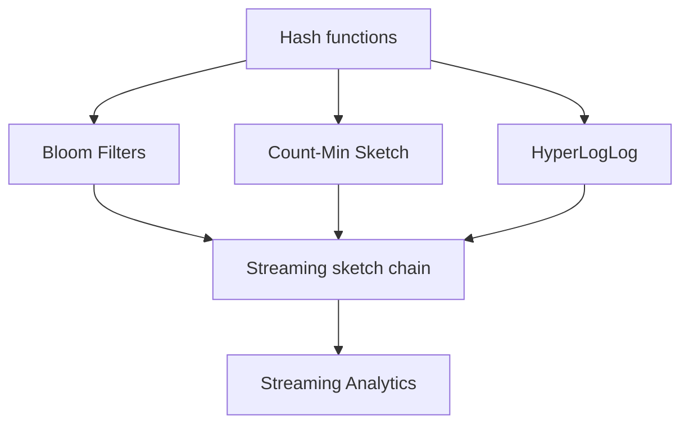

## Prerequisites



## When to use

- **One-pass telemetry** where the full stream cannot be stored or replayed (router logs, clickstreams, sensor feeds).
- **Composable summaries** — membership (Bloom), frequencies (CMS), and cardinality (HLL) on the same event stream with fixed RAM.
- **Edge or L1-cache budgets** where exact hash maps would blow memory but approximate answers are actionable.

## When not to use

- You need **exact counts or exact distinct values** for billing, compliance, or audit — store aggregates in a database or use deterministic structures.
- The stream is **small enough to fit in RAM** with a plain `Map` — sketches add hash collision risk for little gain.
- **Per-key deletion or updates** are required — classic sketches are append-only; use counting variants or different structures.

## Lab

On the [interactive streaming algorithms lab](/topics/streaming-algorithms#lab), scrub **Stream position** through a synthetic router trace and pick a **query IP**. Watch **Count-Min**, **HyperLogLog**, and **Bloom** update from the same prefix, compare each sketch to **ground truth**, and try **DDoS heavy hitter**, **Early stream**, or **Long-tail probe** presets. Predict whether CMS will **overestimate** a hot IP and whether Bloom can flag a key that never appeared, then reveal the side-by-side metrics.

## Simple Fundamental Explanation
Imagine you are a highway toll operator. You want to know the most common color of car driving past.
- **Traditional Database**: You take a photo of every single car, store millions of photos in a filing cabinet, and at the end of the day, you count them all. (Requires massive storage).
- **Streaming Algorithm**: You have a small notepad. You see a Red car, you write `Red: 1`. You see a Blue car, you write `Blue: 1`. You see another Red car, you erase `1` and write `2`. You never store the photos. You only store the running tally.

A **Streaming Algorithm** processes a continuous, massive sequence of data items (the stream) by examining each item only once (or a few times) and maintaining a tiny summary (a "sketch") in memory. It is the mathematical engine behind `STREAMING_ANALYTICS.md`.

---

## Deep Dive: How It Works Under the Hood

The constraints of the Streaming Model are extreme:
1. The stream is too large to fit in memory (often petabytes).
2. You only get to see each data point once as it flies past. You cannot "go back" and re-read it.
3. Your available RAM is microscopic compared to the data size (e.g., $O(\log N)$ or $O(1)$).

To survive these constraints, streaming algorithms almost universally rely on hashing and probabilistic approximation.

### Reservoir Sampling
Problem: You have a stream of unknown length $N$. You want to pick exactly $k$ items completely at random from the stream. But because you don't know $N$, you can't just pick a random number between 1 and $N$.

Solution (Reservoir Sampling):
1. Keep the first $k$ items in memory (the reservoir).
2. For the $i$-th item (where $i > k$), pick a random number $j$ between 1 and $i$.
3. If $j \le k$, replace the $j$-th item in the reservoir with the new item. Otherwise, ignore the new item.
This mathematically guarantees that when the stream eventually stops, every item that ever passed by had an exactly equal probability ($k/N$) of ending up in the reservoir.

### Visual Diagram: Flajolet-Martin Algorithm (Frequency)

<!-- diagram -->
```diagram
Stream of items: A, B, A, C, C, A, D, E, A
Memory limit: Only 2 counters allowed!

1. 'A' arrives. Counters: [(A: 1)]
2. 'B' arrives. Counters: [(A: 1), (B: 1)]
3. 'A' arrives. Counters: [(A: 2), (B: 1)]
4. 'C' arrives. Memory full!
   Rule: If full, decrement ALL existing counters. If a counter hits 0, delete it.
   Counters become: [(A: 1)] (B is deleted).
   'C' is ignored (or wait, it's actually just not tracked).
5. 'C' arrives. Counters: [(A: 1), (C: 1)]
6. 'A' arrives. Counters: [(A: 2), (C: 1)]

At the end, 'A' dominates the counters. This algorithm finds the "Majority" element using almost no RAM.
```

---

## Practical Example: Network Traffic Monitoring

Cisco routers process terabytes of internet traffic per second. They need to identify DDoS attacks (e.g., millions of tiny packets originating from a single IP address).

If the router logged the IP of every packet to a hard drive, the router would crash.
If the router kept an exact hash map of `IP -> Count` in RAM, the memory would fill up in seconds.

Instead, routers use streaming algorithms like the Count-Min Sketch (see `COUNT_MIN_SKETCH.md`). As a packet arrives, its IP is hashed, the sketch is updated, and the packet is immediately forwarded or discarded. The router maintains a tiny, fixed-size matrix in the L1 CPU cache that can instantly and probabilistically flag if an IP has exceeded the normal traffic threshold.

---

## The Mathematics: Equations and In-Depth Analysis

### The Alon-Matias-Szegedy (AMS) Algorithm
One of the most profound theoretical results in streaming algorithms is calculating the **Frequency Moments** of a stream.
Let $f_i$ be the number of times item $i$ appears in the stream.
The $k$-th frequency moment is $F_k = \sum f_i^k$.
- $F_0$ is the number of *distinct* elements (cardinality). (HyperLogLog solves this).
- $F_1$ is the total length of the stream.
- $F_2$ is a measure of the "skew" or variance of the data (the Gini index).

AMS proved that you can approximate $F_2$ using surprisingly little memory.
1. The algorithm generates a random hash function $h(x)$ that maps every item to either $+1$ or $-1$.
2. It maintains a single running counter $Z$, initialized to 0.
3. When item $i$ arrives, $Z \leftarrow Z + h(i)$.
4. The final estimate for $F_2$ is exactly $Z^2$.

**Why does this work?**
Because the hash function maps items uniformly to $+1$ and $-1$, the expected value of the cross terms $h(i)h(j)$ is 0.
When you square $Z$, you get:

$$
Z^2 = \left( \sum f_i h(i) \right)^2 = \sum f_i^2 h(i)^2 + \sum_{i \ne j} 2 f_i f_j h(i) h(j)
$$

Since $h(i)^2 = (\pm 1)^2 = 1$, the first term is exactly $F_2$.
The expected value of the second term is 0.
Therefore, $\mathbb{E}[Z^2] = F_2$.

By running several of these counters in parallel and taking the median of averages, the AMS algorithm can accurately estimate the mathematical variance of a massive data stream using only logarithmic space $O(\log N)$.
