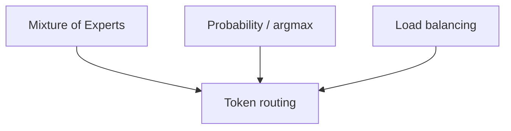

## Prerequisites



## When to use

- **Sparse MoE inference** where each token activates only Top-K experts (Switch, Mixtral-style).
- **Capacity scaling** with controlled active compute per token.
- **Studying load imbalance** and auxiliary losses when routers favor a few experts.

## When not to use

- **Dense transformers** where every layer uses all weights — no routing layer exists.
- **Strict per-expert fairness** without expert-choice routing or balancing loss — naive Top-K can starve experts.
- **Tiny batches** where routing noise dominates signal.

## Lab

On the [interactive token routing lab](/topics/token-routing#lab), set **experts**, **tokens**, and **Top-K**, watch the **load histogram** vs the **ideal uniform** line, try **Switch Top-1**, **Mixtral Top-2**, or **Hotspot skew** presets, predict whether max load exceeds **1.5× ideal**, then reveal **imbalance**.

## Simple Fundamental Explanation
Imagine a massive post office sorting facility.
- **The Old Way**: Every single letter goes onto a conveyor belt. The belt runs through 100 different sorting machines, one after the other. Every letter goes through every machine, even if the letter just needs to go next door.
- **Token Routing**: When a letter arrives, a manager reads the zip code and puts it in a specific pneumatic tube that shoots it *only* to the one exact machine needed to deliver it.

In Large Language Models, text is broken into "tokens" (words or pieces of words). In traditional dense models, every single token passes through every single neural connection (weight) in the model.
**Token Routing** is the probabilistic mechanism used in Mixture-of-Experts (MoE) models (see `MIXTURE_OF_EXPERTS.md`) to dynamically send specific tokens *only* to the specific subnetworks (experts) that are mathematically best suited to process them, bypassing the rest of the model entirely.

---

## Deep Dive: How It Works Under the Hood

### The Gating Network (The Router)
The heart of Token Routing is a tiny, fast neural network called the Router (or Gating Network).

When a token (e.g., the word "Einstein") reaches an MoE layer, its vector representation is fed into the Router.
The Router outputs a probability distribution across all available experts (e.g., "Expert 1: 80%, Expert 2: 15%, Expert 3: 5%").

### Routing Strategies
1. **Top-K Routing**: The most common approach. The router simply selects the $K$ experts with the highest probabilities (usually $K=1$ or $K=2$). The token is sent *only* to those experts. The outputs of those experts are then combined using the probabilities as weights.
2. **Expert Choice Routing**: Instead of the token choosing the top $K$ experts, each *expert* looks at all the tokens in the batch and chooses the top $N$ tokens it wants to process. This ensures perfect load balancing, as every expert processes exactly $N$ tokens.

### Visual Diagram: Top-1 Token Routing

<!-- diagram -->
```diagram
Sentence: "The cat sat."
Tokens: [T1:"The", T2:"cat", T3:"sat"]

[ ROUTER NETWORK ]
Evaluates T1, T2, T3.

Probabilities:
T1 ("The") -> Expert 3 (99%)
T2 ("cat") -> Expert 1 (85%)
T3 ("sat") -> Expert 1 (90%)

Routing Execution:
[ Expert 1 ] processes: "cat", "sat"
[ Expert 2 ] processes: (Idle, no tokens assigned)
[ Expert 3 ] processes: "The"

Because Expert 2 was skipped entirely, the system saved 33% of its compute power instantly!
```

---

## Practical Example: Switch Transformer

Google designed a massive AI model called the Switch Transformer. It scaled to 1.6 Trillion parameters, which at the time was mind-boggling.
If it were a dense model, computing 1.6 Trillion parameters per word would require a supercomputer for every single sentence generated.

They used a hyper-aggressive Token Routing strategy: **Top-1 Routing**.
They created thousands of tiny experts. For every token, the router picked the absolute #1 best expert and sent the token *only* there.
This meant that for any given word, the active compute used was only a tiny fraction of the 1.6 Trillion parameters. The model had the vast "knowledge capacity" of a trillion-parameter brain, but the inference speed and energy cost of a standard, small model.

---

## The Mathematics: Equations and In-Depth Analysis

### 1. The Gating Function
Let $x$ be the input token vector. Let $W_g$ be the weight matrix of the gating network.
The raw scores (logits) for the $N$ experts are $H(x) = x \cdot W_g$.
The probabilities $P(x)$ are generated via Softmax:

$$
P(x)_i = \frac{e^{H(x)_i}}{\sum_{j=1}^N e^{H(x)_j}}
$$

If we are using Top-K routing, the output of the entire MoE layer is:

$$
y = \sum_{i \in \text{TopK}(P(x))} P(x)_i \cdot \text{Expert}_i(x)
$$

Notice that we multiply the expert's output by the probability $P(x)_i$. This is crucial. It means the Router's decision process is *differentiable*. During training, if Expert $i$ gives a terrible answer, the backpropagation math will reduce $P(x)_i$, causing the Router to learn not to send similar tokens to Expert $i$ in the future.

### 2. The Capacity Factor and Dropped Tokens
What happens if the Router decides to send *every single token* in a sentence to Expert 1?
Expert 1's memory buffer will overflow, and Experts 2-8 will sit idle.

To prevent this in hardware implementations, each expert has a strict physical buffer size, called the **Capacity Factor ($C$)**.

$$
\text{Expert Capacity} = \frac{\text{Tokens in Batch}}{\text{Number of Experts}} \times C
$$

Usually, $C \approx 1.25$. This means an expert is only allowed to process 25% more tokens than its perfectly fair share.

If the router tries to send 100 tokens to an expert that only has capacity for 50, the expert processes the first 50. The remaining 50 tokens are mathematically **Dropped**. They bypass the expert layer entirely, passing through as a residual connection (zeros).
This sounds catastrophic, but neural networks are probabilistically resilient. The threat of dropped tokens forces the auxiliary load-balancing loss function to aggressively train the router to distribute tokens evenly, ensuring the hardware runs at peak efficiency.
